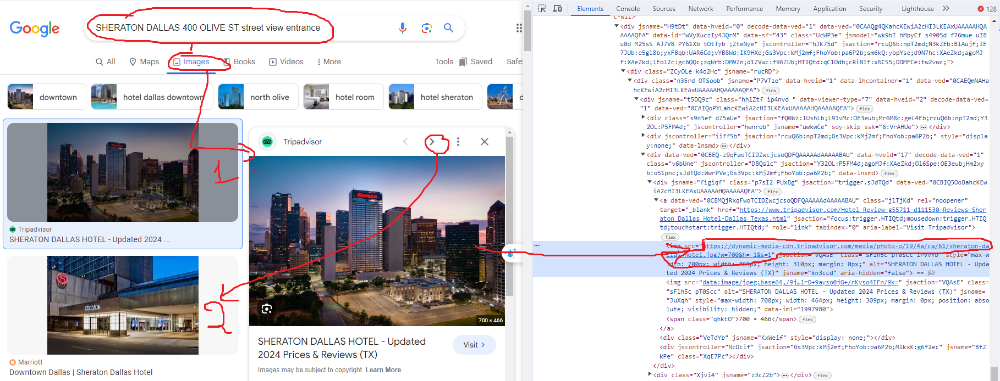
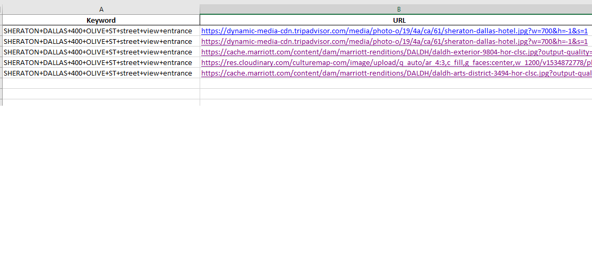

# get-image-link-in-ggsearch
Get the first 5 images from GG SEARCH results for each keyword.

# Request:


# Image Scraping Workflow
## Step 1: Read CSV and get keyword
- Read a CSV file to obtain keywords for image search.
## Step 2: Use gg search
- Utilize Google search to find images related to the obtained keywords.
## Step 3: Get URL for 5 first images
- Extract the URLs of the first 5 images from the search results.
## Step 4: Save in CSV
- Save the extracted image URLs in a CSV file for further use.

# Output for sample keyword:


# Source Code:
```python
from ast import While, keyword
from selenium import webdriver
from selenium.webdriver.firefox.options import Options
from bs4 import BeautifulSoup
from time import sleep
from selenium.webdriver.common.by import By
from selenium.webdriver.common.keys import Keys
from selenium.webdriver.support.ui import WebDriverWait
from selenium.webdriver.support import expected_conditions as EC
from selenium.webdriver.common.action_chains import ActionChains
import pandas as pd
import datetime
import tkinter as tk
from tkinter import FIRST, messagebox


class WebScraper:
    def __init__(self):
        # Initialize the webdriver
        self.firefox_options = Options()
        self.firefox_options.headless = True
        self.driver = webdriver.Firefox(options=self.firefox_options)
        self.actions = ActionChains(self.driver)
        self.data_export = []

    def close_browser(self):
        self.driver.quit()

    def navigate_to_url(self, url):
        self.driver.get(url)
        sleep(5)  # Adjust sleep as needed

    def Start(self,Keyword):


        #first picture:
        Xpath = "/html/body/div[2]/c-wiz/div[3]/div[1]/div/div/div/div/div[1]/div[1]/span/div[1]/div[1]/div[1]/a[1]/div[1]/img"
        self.driver.find_element(By.XPATH,Xpath).click()
        sleep(1)

        maxpic = 6
        count = 0
        while count < maxpic:
            # Now that the content is loaded, get the HTML
            print('Render the dynamic content to static HTML')
            html = self.driver.page_source       
            print(' Parse the static HTML')
            soup = BeautifulSoup(html, "html.parser")
            
            # Find all occurrences of 'div' with class " "
            divs = soup.find("div", {"class": "p7sI2 PUxBg"})
            imglink = divs.find('img')
            # Get the value of the src attribute
            src_value = imglink['src']
            print('src_value: ', src_value)
            self.data_export.append({'Keyword': Keyword, 'URL': src_value})

            #next picture:
            next = "/html/body/div[2]/c-wiz/div[3]/div[2]/div[3]/div[2]/div[2]/div[2]/div[2]/c-wiz/div/div/div/div/div[1]/div/div[2]/button[2]/div"
            self.driver.find_element(By.XPATH,next).click()
            sleep(1)
            count += 1
 
    def export_to_excel(self, file_name='output.xlsx'):
        # Create a DataFrame from the list of dictionaries
        df = pd.DataFrame(self.data_export)

        # Export DataFrame to Excel
        df.to_excel(file_name, index=False)
        print(f'Data exported to {file_name}')


# Example usage:
if __name__ == "__main__":
    #get keyword in excel:
    #Sample keyword: (Can modify for multi Keywords)
    Keyword = "SHERATON+DALLAS+400+OLIVE+ST+street+view+entrance"
    url = "https://www.google.com/search?sca_esv=14fbc76bdf925f77&sxsrf=ACQVn0-9HKj9c6w6WfoxmL0kqh-Lnf-CAQ:1708184802901&q=" + Keyword + "&tbm=isch&source=lnms&prmd=ivsnbtz&sa=X&ved=2ahUKEwiByIyj3LKEAxW3bvUHHTobAx4Q0pQJegQIEBAB&biw=1920&bih=937&dpr=1"
    scraper = WebScraper()

    try:
        scraper.navigate_to_url(url)
        scraper.Start(Keyword)
        scraper.export_to_excel()

    finally:
        scraper.close_browser()
